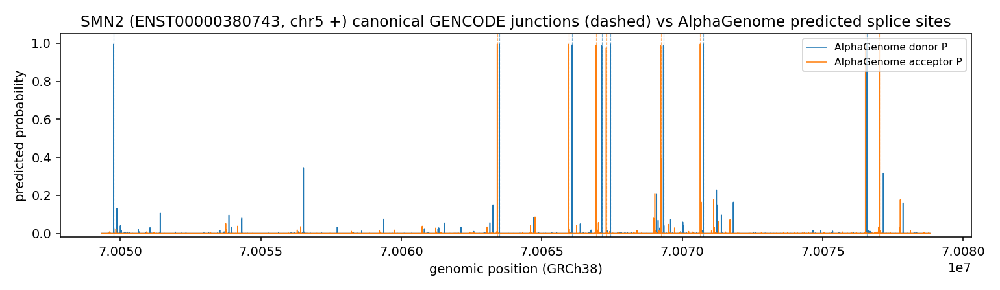
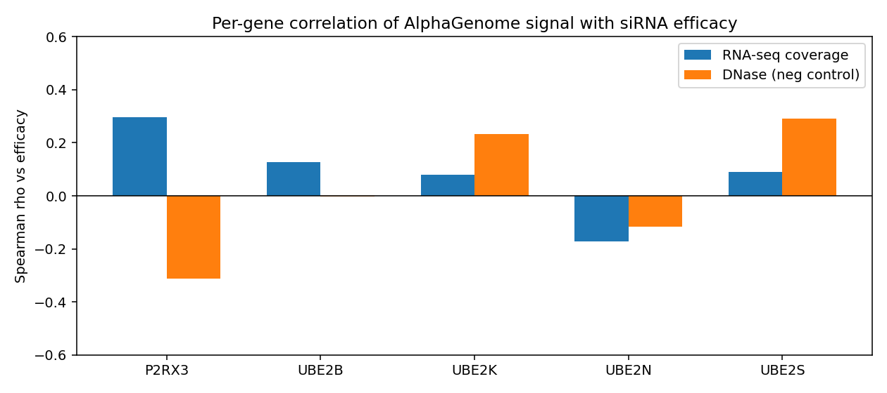
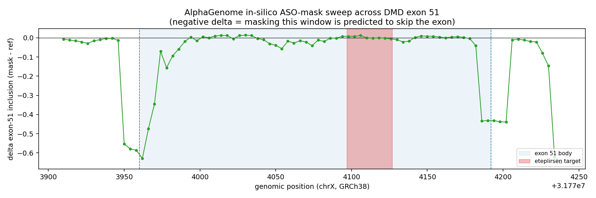
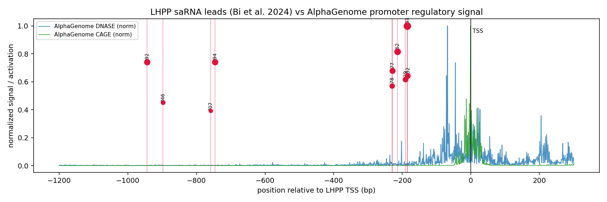

# alphagenome-oligo-reach

Probes of AlphaGenome (DeepMind, Sep 2026) signal against three oligonucleotide modalities: siRNA
efficacy, splice-switching ASO target sites, and saRNA promoter activation, plus a splice-site
recovery positive control. Each numbered folder is a self-contained analysis that pulls public data,
queries the AlphaGenome API, and writes a figure and a results table.

GRCh38 throughout. Gene/exon coordinates and genomic sequence come from Ensembl REST.

## Requirements
```
pip install -r requirements.txt
export ALPHAGENOME_API_KEY=your_key   # non-commercial key from the AlphaGenome API
```

## Layout
```
01_splice_recovery/    predicted splice sites vs canonical GENCODE junctions (SOD1, SMN2, TTR)
02_sirna_efficacy/     per-site AlphaGenome signal vs measured siRNA knockdown (338 siRNAs, 5 genes)
03_sso_insilico_mask/  in-silico ASO masking across DMD exon 51 vs predicted inclusion
04_sarna_activation/   promoter signal vs saRNA activation (LHPP, 10 leads)
```

## Run
```
python 02_sirna_efficacy/fetch_data.py            # pulls the public siRNA inputs
python 01_splice_recovery/ag_splice_compare.py
python 02_sirna_efficacy/ag_sirna.py
python 02_sirna_efficacy/ag_sirna_plot.py
python 03_sso_insilico_mask/dmd_sweep.py
python 03_sso_insilico_mask/dmd_sweep_psi.py
python 04_sarna_activation/sarna_lhpp.py
```
Each script writes its outputs next to itself.

## 01 splice-site recovery
**Method.** Canonical transcript exons from Ensembl. `predict_interval` with `SPLICE_SITES` over the
locus. An internal donor/acceptor is scored recovered if predicted probability > 0.5 within 3 bp of
the annotated boundary. Background = mean predicted probability away from any annotated site.

| gene | transcript | donor | acceptor | mean P at true sites | background P |
|---|---|---|---|---|---|
| SOD1 | ENST00000270142 | 4/4 | 4/4 | 1.00 | 0.0004 |
| SMN2 | ENST00000380743 | 8/8 | 8/8 | 0.99 | 0.0001 |
| TTR  | ENST00000237014 | 3/3 | 3/3 | 1.00 | 0.0002 |



Per-gene figures `splice_SOD1.png`, `splice_SMN2.png`, `splice_TTR.png`; table `splice_summary.json`.

## 02 siRNA efficacy
**Method.** 338 siRNAs (siRNADiscovery HUVK set; P2RX3, UBE2B/S/N/K). Each target mapped to the genome
by exact match, dropping junction-spanning targets. `predict_interval` with `RNA_SEQ`, `DNASE`,
`SPLICE_SITE_USAGE`; per-site mean signal over the target window; Spearman vs efficacy. DNase is a
negative control.

| feature | Spearman rho | p | n |
|---|---|---|---|
| RNA_SEQ | -0.088 | 0.11 | 338 |
| SPLICE_SITE_USAGE | -0.030 | 0.58 | 338 |
| DNASE (neg. control) | -0.218 | 5e-5 | 338 |

Per-gene rho ranges +0.30 (P2RX3) to -0.17 (UBE2N); no sign-consistent predictor. The only feature
clearing significance is the negative control.



Pooled scatter `ag_sirna_pooled.png`; tables `ag_sirna_features.csv`, `ag_sirna_summary.json`.

## 03 splice-switching ASO (DMD exon 51)
**Method.** 20 nt window in 4 nt steps across DMD exon 51 (chrX, GRCh38) and 60 nt of each flank.
Transition-mutate each window to mimic an ASO blocking that element, `predict_sequence`, read the
change in exon-51 inclusion. Two readouts: `SPLICE_SITE_USAGE` at the exon-51 sites, and
inclusion/skip PSI from `SPLICE_JUNCTIONS`. Baseline PSI 0.99.

| region | Δ inclusion (usage) | Δ inclusion (PSI) |
|---|---|---|
| donor 5′SS flank | -0.27 | -0.23 |
| exon interior | -0.007 | -0.003 |
| eteplirsen target | +0.002 | -0.000 |

Masking a splice site collapses inclusion; the exon interior and the eteplirsen target site are flat
under both readouts.



Second readout `dmd_exon51_psi.png`; tables `dmd_sweep.csv`, `dmd_sweep_psi.csv`.

## 04 saRNA activation (LHPP)
**Method.** 10 validated LHPP-promoter saRNA leads (Bi et al. 2024; sequences from S1 Table,
activation = mean of Huh7 and HepG2 from Fig 3). Each mapped to its promoter position.
`predict_interval` with `CAGE`, `PROCAP`, `DNASE`, `ATAC`; peak signal over the target window;
Spearman vs activation.

| feature | Spearman rho | p | n |
|---|---|---|---|
| CAGE | +0.26 | 0.46 | 10 |
| PROCAP | +0.21 | 0.57 | 10 |
| DNASE | +0.28 | 0.44 | 10 |
| ATAC | +0.34 | 0.34 | 10 |

Underpowered at n=10, no feature significant, all four positive. Potent leads localize to the
TSS-proximal signal; weak leads fall in flat sequence.



Table `sarna_lhpp_features.csv`.

## Data sources
AlphaGenome API (https://github.com/google-deepmind/alphagenome). siRNA: siRNADiscovery, Long et al.,
Brief Bioinform 2024. Splice-switching reference: Hua et al., PLoS Biol 2007; DMD exon 51 is
eteplirsen's target. saRNA: Bi et al., PLoS ONE 2024, doi:10.1371/journal.pone.0299522 (LHPP).

## License
MIT, see LICENSE.
