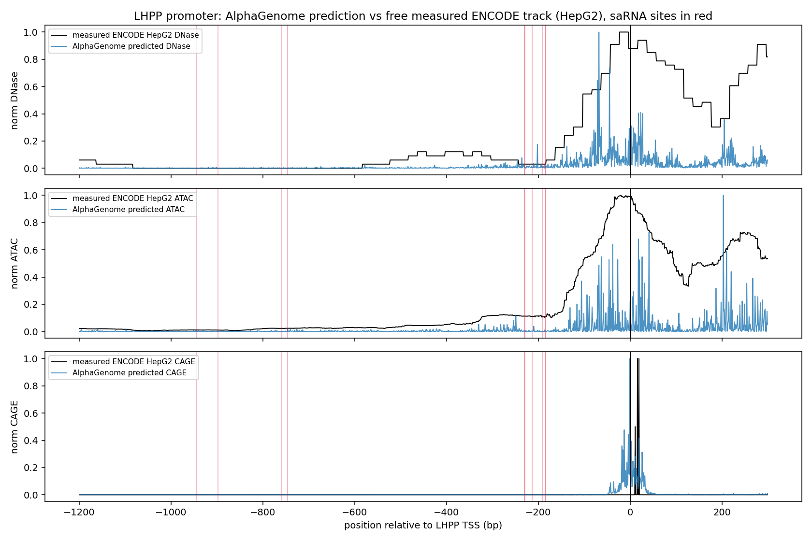

# alphagenome-oligo-reach

AlphaGenome predicts functional-genomics tracks (accessibility, splicing, expression) from sequence.
For oligonucleotide drug design against known human targets, those tracks are already measured and
free on ENCODE, GENCODE and NCBI. So the question is not whether AlphaGenome is a good model. It is
whether the prediction buys you anything over the free public lookup, and where it is weaker.

Short answer for the tasks here: against canonical human targets it mostly reproduces the free
tracks, ties or loses to the measured version, and the one design step where a predictor could beat a
lookup, finding the regulatory element you actually target, is where it goes flat.

GRCh38 throughout. Coordinates and sequence from Ensembl REST. Measured tracks from ENCODE (HepG2).

## saRNA target selection: prediction vs the free ENCODE track  (05_predicted_vs_measured)
Task, pick promoter positions that activate LHPP, using the 10 validated saRNA leads from Bi et al.
2024 (Ractigen). AlphaGenome PREDICTED DNase/ATAC/CAGE against the MEASURED ENCODE HepG2 tracks (same
cell line as the assay), each ranked against activation.

| track | measured ENCODE vs activation | AlphaGenome predicted vs activation |
|---|---|---|
| DNase | +0.28 | +0.28 |
| ATAC | +0.41 | +0.34 |
| CAGE | flat, marks the TSS not the upstream target window | +0.26 |

Spearman, n=10. On DNase the prediction and the free measurement rank the sites identically. On ATAC
the free measurement is better. CAGE is the wrong track for upstream sites because it marks the 5' cap.
For this task the API key adds nothing a free ENCODE download does not already give you.



## splice map: redundant with the annotation  (01_splice_recovery)
AlphaGenome recovers every internal canonical junction of SOD1, SMN2 and TTR (4/4, 8/8, 3/3;
predicted probability ~1.0 at true sites vs ~0.0002 background). But those junctions are already in
the GENCODE GTF you can download for free. For a known gene this is a positive control, not a design
capability.


## splice-switching ASO: where a predictor could beat a lookup, and does not  (03_sso_insilico_mask)
The one step annotation cannot hand you is which exonic element to block for exon skipping. In-silico
ASO masking across DMD exon 51 (eteplirsen's exon), two readouts.

| region | Δ inclusion (usage) | Δ inclusion (PSI) |
|---|---|---|
| donor 5′SS flank | -0.27 | -0.23 |
| exon interior | -0.007 | -0.003 |
| eteplirsen target | +0.002 | -0.000 |

Masking a splice site collapses inclusion (trivial). The exon interior and the eteplirsen target site
stay flat under both readouts, at baseline PSI 0.99 so there was room to move. It has the splice-site
grammar, not the regulatory elements the drug targets.


## siRNA efficacy: off-axis control  (02_sirna_efficacy)
siRNA acts on the mature mRNA through RISC, not through anything a genome track sees. Included as the
off-axis control. 338 siRNAs across 5 genes; AlphaGenome signal correlates no better than a DNase
negative control (pooled RNA-seq -0.09, n.s.; DNase control -0.22, p=5e-5; per-gene signs flip). Neither
AlphaGenome nor any NCBI track helps here, which is the expected result for the wrong axis.


## Verdict
For oligo design against known human loci in common cell types, the free ENCODE and GENCODE tracks
match or beat AlphaGenome, and it does not deliver the one thing a predictor could add over a lookup.
Its real edge is sequence and context with no measured track, novel variants and unprofiled cell types,
none of which these tasks needed.

## Requirements
```
pip install -r requirements.txt
export ALPHAGENOME_API_KEY=your_key   # non-commercial key from the AlphaGenome API
```

## Run
```
python 02_sirna_efficacy/fetch_data.py            # public siRNA inputs
python 05_predicted_vs_measured/sarna_vs_encode.py
python 01_splice_recovery/ag_splice_compare.py
python 03_sso_insilico_mask/dmd_sweep.py
python 03_sso_insilico_mask/dmd_sweep_psi.py
python 02_sirna_efficacy/ag_sirna.py
python 02_sirna_efficacy/ag_sirna_plot.py
python 04_sarna_activation/sarna_lhpp.py          # AlphaGenome-only saRNA view (superseded by 05)
```
Each script writes its outputs next to itself.

## Data sources
AlphaGenome API (github.com/google-deepmind/alphagenome). Measured tracks: ENCODE HepG2 DNase
(ENCFF995ZMK), ATAC (ENCFF645OHB), CAGE + strand (ENCFF452THO). siRNA: siRNADiscovery, Long et al.,
Brief Bioinform 2024. Splice-switching reference: Hua et al., PLoS Biol 2007; DMD exon 51 is
eteplirsen's target. saRNA: Bi et al., PLoS ONE 2024, doi:10.1371/journal.pone.0299522 (LHPP).

## License
MIT, see LICENSE.
